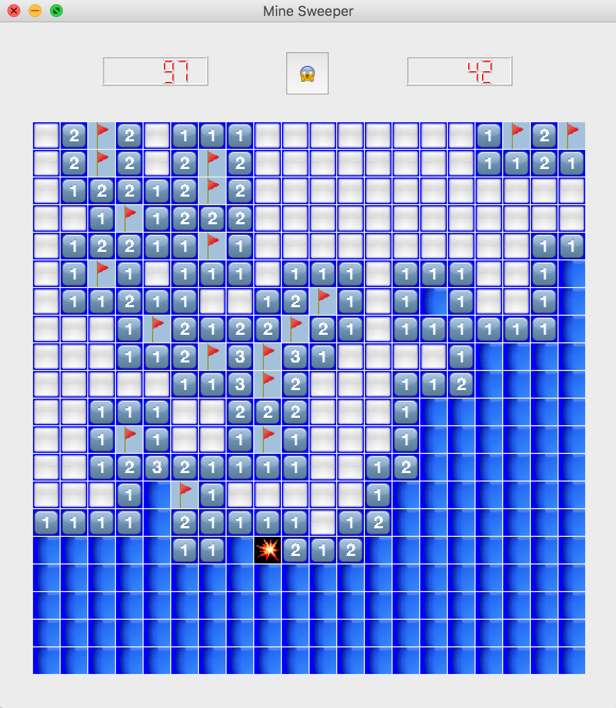

# MineSweeper

[](https://github.com/duguyue100/minesweeper)
[](https://github.com/duguyue100/minesweeper)

[](https://travis-ci.org/duguyue100/minesweeper)
[](https://ci.appveyor.com/project/duguyue100/minesweeper)
[](https://www.codacy.com/app/duguyue100/minesweeper?utm_source=github.com&amp;utm_medium=referral&amp;utm_content=duguyue100/minesweeper&amp;utm_campaign=Badge_Grade)
[](https://raw.githubusercontent.com/duguyue100/minesweeper/master/LICENSE)

A python Minesweeper with interfaces for Reinforcement Learning.

This is a simple game I wrote for learning _Deep Reinforcement Learning_.

## How to Install

In order to install this package, you need to have at least

+   `numpy`
+   `pyqt`

installed. If you don't want to bother with details of packages installation,
you can use [Anaconda](https://anaconda.org/) as your Python distribution.

And then install the package by

__From PyPI (the latest stable version)__

```bash
pip install minesweeper
```

or

__From GitHub (the bleeding edge version)__

```bash
pip install git+git://github.com/duguyue100/minesweeper.git \
-r https://github.com/duguyue100/minesweeper/blob/master/requirements.txt
```

Once you installed, you can start the Mine Sweeper GUI by typing following
under terminal

```bash
ms-gui.py # yeah, with .py, otherwise Windows CMD may not be able to find it!
```

## Objectives

+   A command line mine sweeper game.
+   A GUI interface.
+   Interfaces for receiving move info and send board status.
+   Capability of playing multiple games using different UDP ports.

## Todo List

+   [x] Basic structure setup
+   [x] update rules for `msboard` (click)
+   [x] update rules for `msboard` (flag)
+   [x] update rules for `msboard` (unflag)
+   [x] update rules for `msboard` (question)
+   [x] TCP interface for the game
+   [x] console interface for the game
+   [x] GUI interface for the game
+   [x] Complete reset button and end game condition
+   [x] Control GUI interface through remote commands (another thread?)
+   [ ] Write Tests, collect user feedback (if possible)
+   [ ] Write more TCP connection related functions (e.g. dump array)
+   [ ] Design, train and test a DQN controller (learning on the way :)).
+   [ ] Demo for the trained controller.
+   [ ] Handling arbitrary size of board.
+   [ ] Play game only with pixel inputs?

## Screen Shot



## The GUI Player

```bash
usage: ms-gui.py [-h] [--board-width BOARD_WIDTH]
                 [--board-height BOARD_HEIGHT] [--num-mines NUM_MINES]
                 [--port PORT] [--ip-add IP_ADD]

Mine Sweeper Minesweeper with interfaces for Reinforcement Learning by Yuhuang
Hu

optional arguments:
  -h, --help            show this help message and exit
  --board-width BOARD_WIDTH
                        width of the board.
  --board-height BOARD_HEIGHT
                        height of the board.
  --num-mines NUM_MINES
                        number of mines.
  --port PORT           The port for TCP connection.
  --ip-add IP_ADD       The IP address for TCP connection.
```

The default value of the game is

```python
board_width = 20
board_height = 20
num_mines = 40
port = 5678
ip_add = "127.0.0.1"
```

## Control The Game

As shown in [test-board.py](scripts/test-board.py), you can control the game
through the APIs. This provides a way of accessing and generating large
number of games by designing your own flow.

Alternatively, you can also access and control a game through TCP connections.
The examples is given in [test-tcp-com.py](scripts/test-tcp-com.py).
The TCP connection is initiate by given IP address and port number.
You can easily connect the connection using `netcat` (for Mac OS X, `nc`), e.g.

```bash
nc 127.0.0.1 5678
```

Once you connected, type `help` for viewing command line.

```bash
Welcome to Mine Sweeper!
You have 5 types of moves to use:
(1) Click	: click: X, Y
(2) Flag	: flag: X, Y
(3) Question	: question: X, Y
(4) Unflag	: unflag: X, Y
(5) Print board: print
```

Of you can still use other programs for controlling the game.
Please check related APIs from [msgame.py](minesweeper/msgame.py)

## Contacts

Yuhuang Hu  
Email: duguyue100@gmail.com
